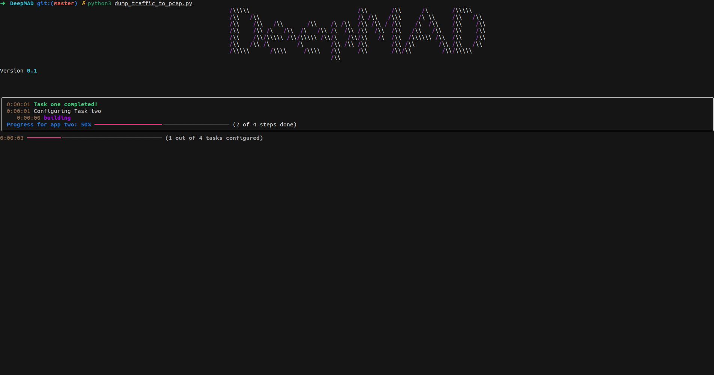

WORK IN PROGRESS: We devised a initial build of tool that will capture network stream from a live network through Wireshark's Commad-line utility called Dumpcap. 



# Dumpcap
Find Dumpcap documentation [here](https://www.wireshark.org/docs/man-pages/dumpcap.html).
Like this for example:

```
dumpcap -i wlp1s0 -a filesize:600 -w pcapF/data.pcap

```

Once we have captured a pcap file, now its time to pass it to PRC Flowmeter v0.2.0.

# RUN dump_traffic_to_pcap.py 
    python3 dump_traffic_to_pcap.py

# PRC Flowmeter v0.2.0

Flowmeter is a Scapy-based tool for deriving statistical features from PCAPs for data analysis and machine learning. The features are based on the java application [CICFlowmeter](https://github.com/ahlashkari/CICFlowMeter/)

Based heavily on [this flowmeter app](https://github.com/alekzandr/flowmeter)

# Usage

A Flowmeter object is created with up to three parameters:

- offline (str) - filename of a pcap file; if none provided, streams from available ports (requires run as admin in linux-based environments.)
- outfunc (function) - a csv rendition of the metered flows will be sent to this function as they are created. If none provided, will default to print().
- outfile (str) - filename to store csv flow output. If none is provided, results are not stored.

Building off of scapy Sessions, Flowmeter separates packet streams into distinct network communication 'flows', which are identified simply as communications between two endpoints (ip:port) on a given protocol within a period of time. From there it begins analyzing the flow data to derive features useful for plotting, traffic pattern analysis, and machine learning.

```
from flowmeter import Flowmeter

feature_gen = Flowmeter(
    offline = "input.pcap",
    outfunc = None,
    outfile = "output.csv")

feature_gen.run()

```

<!--
# Contributions
If you would like to contribute feel free to fork the repo, clone the project, submit pull requests, open issues, or request features/enhancements.

# License
PRCFlowmeter is currently licensed under the GNU GPLv2. -->

Now we got a csv file that contain Bi-flows and alot of details that is not need, so we preprocess and normalize (all feature to scale in 0 to 255 range) the file, change the datatype to 'uint8', and in the end convert file to HDF5 format.

# Model Selection

We have trained several Machine Learning and Deep Learning models, and saved their weights in HDF5 format, once model predict/ classify the activity, proper log file will be maintained to keep track of any malicious activity.

# Acknowledgments

We used an Open Source tool for deriving statistical features from PCAP data, called [PRC Flowmeter v0.2.0](https://github.com/prc-hsv/flowmeter).

# Future Work

We are still working on this project and devising a complete deployable tool to Open Source community.
